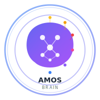

<div align="center">
  
  <h1>AMOS Brain</h1>
  <p><strong>Absolute Meta Operating System</strong></p>
  <p>A comprehensive AI agent framework with structured reasoning, cognitive compliance, and multi-agent orchestration.</p>
</div>

---

## 🧠 What is AMOS Brain?

AMOS Brain is a unified cognitive architecture that adds structured reasoning capabilities to AI agents:

- **Rule of 2** - Dual perspective analysis (L2 reasoning)
- **Rule of 4** - Four quadrant systems thinking (L3 reasoning)
- **6 Global Laws** - L1-L6 compliance enforcement
- **12 Domain Engines** - Routing to specialized intelligence
- **Memory & Recall** - Persistent reasoning history
- **Analytics Dashboard** - Decision pattern insights
- **Multi-Agent Orchestration** - Coordinated agent teams

---

## 🚀 Quick Start

```bash
# Unified launcher - discover all features
python amos_brain_launcher.py

# Or start with tutorial
python amos_brain_tutorial.py

# Or use the CLI
python amos_brain_cli.py
```

See `amos_brain/README.md` and `AMOS_BRAIN_GUIDE.md` for full documentation.

---

## 📦 Project Structure

| Component | Description |
|-----------|-------------|
| `amos_brain/` | Core brain implementation with cognitive architecture |
| `clawspring/` | AI assistant runtime with multi-provider support |
| `AMOS_ORGANISM_OS/` | Organism-level operating system |
| `memory/` | Persistent memory system |
| `skill/` | Skill system with built-in capabilities |
| `multi_agent/` | Multi-agent orchestration |

---

## ✨ Key Features

### Multi-Provider Support
- Anthropic Claude
- OpenAI GPT/o-series
- Google Gemini
- Ollama (local models)
- LM Studio, vLLM, custom endpoints

### Cognitive Architecture
- 6 levels of reasoning (L1-L6)
- Global Laws enforcement
- Domain-specific engines
- Decision analytics

### Agent Capabilities
- 18+ built-in tools
- Persistent memory (dual-scope)
- Skill system with templates
- Multi-agent brainstorming
- Git worktree isolation

---

## 📚 Documentation

- **AMOS_BRAIN_GUIDE.md** - Complete brain documentation
- **AMOS_COGNITIVE_RUNTIME_README.md** - Runtime guide
- **amos_brain/README.md** - Core brain docs

---

## 🔧 Installation

```bash
pip install -e .

# With all optional dependencies
pip install -e ".[clawspring,dev]"
```

---

## 📝 License

MIT License - See LICENSE file for details.

---

## 👤 Founder

**Trang Phan (Trang Q. Phan)**

Visionary technologist and AI architect dedicated to creating structured, compliant, and trustworthy AI systems. AMOS Brain represents years of research in cognitive architectures, multi-agent systems, and AI safety.

[LinkedIn](https://www.linkedin.com/in/trangqphan/) | GitHub: [@trangyp](https://github.com/trangyp)

---

**AMOS Project** - Building the future of AI cognition.

*Crafted with ❤️ by Trang Phan*
