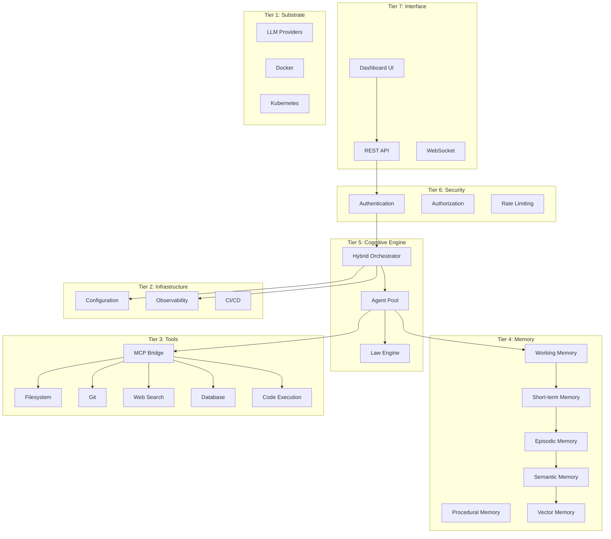

# Architecture

Deep dive into AMOS architecture, components, and design principles.

## Overview

AMOS follows a layered architecture designed for modularity, scalability, and maintainability.

## Design Principles

### 1. Hybrid Neural-Symbolic

AMOS combines neural network pattern recognition with symbolic logical reasoning:

- **Neural**: Pattern matching, semantic understanding, generation
- **Symbolic**: Logical deduction, rule enforcement, structured reasoning
- **Hybrid**: Best of both worlds for complex tasks

### 2. Safety First

Global Laws L1-L6 are enforced on all operations:

- Every action is validated
- Violations are blocked with explanations
- Human oversight for critical decisions

### 3. Tiered Memory

Five memory tiers for optimal information retention:

| Tier | Purpose | Persistence |
|------|---------|-------------|
| Working | Current context | Session |
| Short-term | Recent interactions | Minutes-Hours |
| Episodic | Past experiences | Days-Weeks |
| Semantic | Facts & concepts | Permanent |
| Procedural | Skills & procedures | Permanent |

### 4. Tool Extensibility

MCP (Model Context Protocol) enables tool integration:

- Standardized tool interface
- Easy to add new tools
- Secure execution sandbox

## Architecture Sections

### [Overview](overview.md)
High-level architectural concepts and design decisions.

### [Components](components.md)
Detailed documentation of each AMOS component.

### [Data Flow](data-flow.md)
How data flows through the system during different operations.

---

## Scalability

AMOS is designed to scale:

- **Horizontal**: Multiple AMOS instances behind a load balancer
- **Vertical**: Resource scaling for larger models
- **Agent Pool**: Dynamic agent creation and destruction
- **Memory**: Distributed memory backends

## Security Architecture

Security is built into every layer:

---

!!! info "Contributing"
    Interested in contributing to AMOS architecture? See the [Development Guide](../development/index.md).
