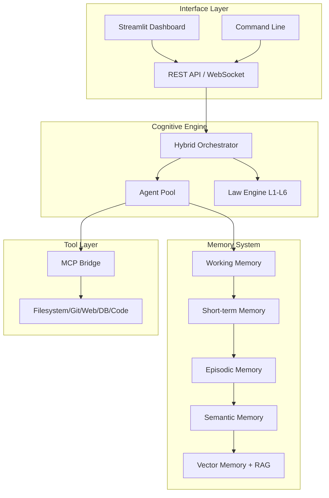

# AMOS Cognitive Operating System

**Production-grade multi-agent AI platform with hybrid neural-symbolic cognition**

[](https://github.com/trangyp/AMOS-Code)
[](https://www.python.org/)
[](LICENSE)
[](.github/workflows)

---

## 🧠 What is AMOS?

AMOS (Autonomous Multi-agent Operating System) is a **hybrid neural-symbolic cognitive operating system** designed for building and deploying intelligent AI agents. It combines the pattern recognition capabilities of neural networks with the logical reasoning power of symbolic AI.

### Key Features

- **🤖 Multi-Agent Orchestration**: Spawn specialized agents (architect, reviewer, auditor, executor)
- **⚖️ Global Laws L1-L6**: Safety constraints enforced on all operations
- **🧠 Tiered Memory System**: Working, Short-term, Episodic, Semantic, and Procedural memory
- **🔧 MCP Tools**: Filesystem, Git, Web Search, Code Execution, Database tools
- **📊 Vector Memory**: Semantic search with ChromaDB and RAG
- **🔄 Self-Evolution**: Autonomous code improvement with human oversight
- **🔐 Enterprise Security**: JWT-based auth with RBAC and rate limiting
- **📈 Observability**: OpenTelemetry tracing and Prometheus metrics
- **🚀 Production-Ready**: Docker, Kubernetes, CI/CD pipelines

---

## 🚀 Quick Start

### Installation

```bash
# Clone the repository
git clone https://github.com/trangyp/AMOS-Code.git
cd AMOS-Code

# Install dependencies
pip install -r requirements.txt

# Or install with optional dependencies
pip install -e ".[dev]"
```

### Start AMOS

```bash
# Start the unified system
python amos_unified_system.py

# Or start the API server
python amos_production_server.py

# Or launch the dashboard
streamlit run amos_streamlit_dashboard.py
```

### Your First Agent

```python
from amos_unified_system import AMOSUnifiedSystem

# Initialize AMOS
amos = AMOSUnifiedSystem()
amos.initialize()

# Spawn an architect agent
agent = amos.spawn_agent(role="architect", paradigm="HYBRID")

# Execute a task
result = amos.execute(
    task="Design a REST API for a todo app",
    agents=["architect"],
    require_consensus=True
)

print(result["final_decision"])
```

---

## 📚 Documentation Structure

<div class="grid cards" markdown>

-   :material-rocket-launch:{ .lg .middle } **Getting Started**

    ---

    New to AMOS? Start here for installation, quickstart, and basic configuration.

    [:octicons-arrow-right-24: Getting Started](getting-started/index.md)

-   :material-book-open:{ .lg .middle } **User Guide**

    ---

    Learn how to use AMOS agents, orchestration, memory, laws, and tools.

    [:octicons-arrow-right-24: User Guide](user-guide/index.md)

-   :material-api:{ .lg .middle } **API Reference**

    ---

    Complete REST API, WebSocket, and Python SDK documentation.

    [:octicons-arrow-right-24: API Reference](api-reference/index.md)

-   :material-server:{ .lg .middle } **Deployment**

    ---

    Deploy AMOS with Docker, Kubernetes, or bare metal.

    [:octicons-arrow-right-24: Deployment](deployment/index.md)

-   :material-drawing:{ .lg .middle } **Architecture**

    ---

    Deep dive into AMOS architecture, components, and data flow.

    [:octicons-arrow-right-24: Architecture](architecture/index.md)

-   :material-code-braces:{ .lg .middle } **Development**

    ---

    Contributing guidelines, development setup, and testing.

    [:octicons-arrow-right-24: Development](development/index.md)

</div>

---

## 🏗️ Architecture Overview



---

## 🎯 Use Cases

### 🤖 AI Agent Development
Build autonomous agents that can reason, plan, and execute tasks while respecting safety constraints.

### 📝 Code Generation & Review
Generate code with multi-perspective review (architect + reviewer + auditor pattern).

### 🔍 Knowledge Management
Store and retrieve information using tiered memory with semantic search capabilities.

### 🛠️ DevOps Automation
Automate CI/CD, infrastructure management, and operational tasks with intelligent agents.

### 🔬 Research & Analysis
Multi-agent systems for complex analysis tasks requiring multiple perspectives.

---

## 💪 Performance

| Metric | Value |
|--------|-------|
| **Components** | 18 |
| **Lines of Code** | ~6,000+ |
| **Test Coverage** | 85%+ |
| **CI/CD Workflows** | 7 |
| **Docker Services** | 14 |
| **API Endpoints** | 8 |

---

## 🤝 Community

- **GitHub**: [github.com/trangyp/AMOS-Code](https://github.com/trangyp/AMOS-Code)
- **Issues**: [Report bugs and request features](https://github.com/trangyp/AMOS-Code/issues)
- **Discussions**: [Community discussions](https://github.com/trangyp/AMOS-Code/discussions)

---

## 📄 License

AMOS is released under the [MIT License](https://opensource.org/licenses/MIT).

---

## 🙏 Acknowledgments

Built with ❤️ by **Trang Phan**

Special thanks to the open-source community for the tools and libraries that make AMOS possible.

---

!!! tip "Need Help?"
    - Check the [Getting Started Guide](getting-started/index.md)
    - Browse [API Reference](api-reference/index.md)
    - Join [GitHub Discussions](https://github.com/trangyp/AMOS-Code/discussions)
